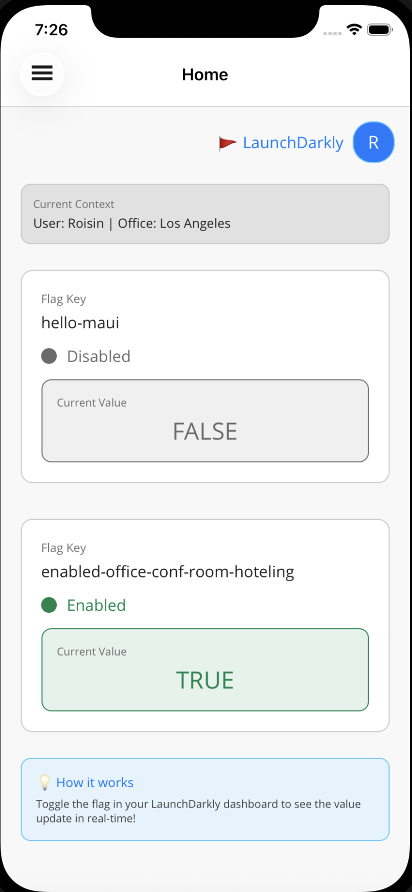
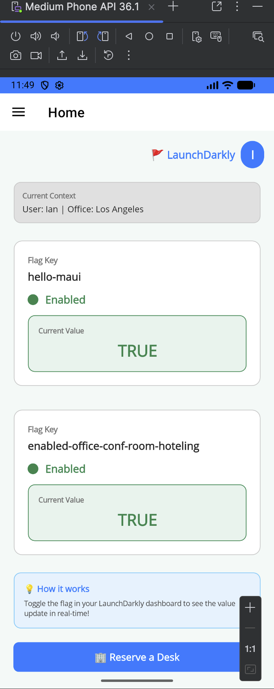

# LaunchDarkly Sample Client-Side .NET Applications

A simple demo that demonstrates how LaunchDarkly's SDK works. There are two applications in the demo: a MAUI app and a .NET Core console app.

The .NET Maui app. Has 3 screens:
- A Home screen showing the state of the 2 flags in use. Updating the flags in LaunchDarkly will demonstrate the immediate nature of the flagging update pattern.
- A login page to switch user context when demonstrating Targeting and Segmenting. The current context is shown on the Home page.
- A reservation page that can switch office context when demostrating Targeting and Segmenting but something other than the default context (user). When the flag is `available` on this page, conference rooms are shown and when `unavailable` the rooms are not shown.s

<p align="center">


</p>
Important: these demos are for the _client-side_ .NET SDK, which is suitable for mobile or desktop applications. For server-side use, see https://github.com/launchdarkly/hello-dotnet-server.

Below, you'll find the basic build procedures, but for more comprehensive instructions, you can visit your [Quickstart page](https://app.launchdarkly.com/quickstart#/) or the [client-side .NET SDK reference guide](https://docs.launchdarkly.com/sdk/client-side/dotnet).

## Instructions for MAUI

The MAUI demo demonstrates LaunchDarkly's client-side SDK running on mobile and desktop platforms. It supports iOS, Android, macOS Catalyst, and Windows.

### Prerequisites

1. **.NET SDK**: .NET 10.0 SDK or later
   - Download from: https://dotnet.microsoft.com/download
   - Verify installation: `dotnet --version`

2. **MAUI Workload**: Install the .NET MAUI workload
   ```bash
   dotnet workload install maui
   ```

3. **Platform-Specific Requirements**:
   - **iOS**: 
     - macOS required
     - [Xcode](https://developer.apple.com/xcode/) (latest version recommended)
     - iOS Simulator (comes with Xcode) or physical iOS device
   - **Android**:
     - [Android SDK](https://developer.android.com/studio) or Android Studio
     - Android Emulator or physical Android device
   - **macOS Catalyst**:
     - macOS required
     - Xcode
   - **Windows**:
     - Windows 10/11
     - Windows SDK

### Configuration

1. **Set your LaunchDarkly Mobile Key**:
   
   Edit `ReservationsDotnetMaui/appsettings.json` and set your mobile key:
   
   ```json
   {
     "LaunchDarkly": {
       "MobileKey": "mob-your-mobile-key-here"
     }
   }
   ```
   
   For development-specific settings, you can also create `appsettings.Development.json`:
   
   ```json
   {
     "LaunchDarkly": {
       "MobileKey": "mob-your-dev-mobile-key-here"
     }
   }
   ```
   
2. **Set your Feature Flag Keys** (optional):
   
   The app uses two feature flags:
   
   - **Main Feature Flag**: Set in `Shared/DemoParameters.cs`:
     ```csharp
     public const string FeatureFlagKey = "my-flag";
     ```
     The default flag key is `"hello-maui"`. Make sure this flag exists in your LaunchDarkly project, or change it to match an existing boolean flag.
   
   - **Hoteling Feature Flag**: The app also uses `"enabled-office-conf-room-hoteling"` to control whether conference room reservations are available. This flag is hardcoded in the app but can be toggled in your LaunchDarkly dashboard to enable/disable conference room functionality.

### Building and Running

#### Using Command Line

**For iOS Simulator:**
```bash
cd ReservationsDotnetMaui
dotnet build -f net10.0-ios -t:Run
```

**For Android Emulator:**
```bash
cd ReservationsDotnetMaui
dotnet build -f net10.0-android -t:Run
```

**For macOS Catalyst:**
```bash
cd ReservationsDotnetMaui
dotnet build -f net10.0-maccatalyst -t:Run
```

**For Windows:**
```bash
cd ReservationsDotnetMaui
dotnet build -f net10.0-windows10.0.19041.0 -t:Run
```

**Specify a specific device/simulator:**
```bash
# iOS - specify simulator name
dotnet build -f net10.0-ios -t:Run -p:_DeviceName="iPhone 15 Pro"

# Android - list available devices first
dotnet build -f net10.0-android -t:Run -p:AndroidSdkDirectory="/path/to/android/sdk"
```

#### Using Visual Studio

1. Open `ReservationsDotnetMaui/ReservationsDotnetMaui.sln` in Visual Studio (Windows/Mac) or Visual Studio Code.

2. Select the `ReservationsDotnetMaui` project as the startup project.

3. Choose your target platform and device/simulator from the device dropdown.

4. Press `F5` or click Run to build and launch the app.

### What to Expect

When the app launches, you should see:
- A login page where you can select a user
- After logging in, a main page showing:
  - Current LaunchDarkly context information
  - Feature flag status and values
  - A button to reserve desks and conference rooms
- The reservation page allows you to:
  - Select an office location
  - Reserve desks or conference rooms (if the hoteling feature flag is enabled)
  - View and manage your reservations

### Live Flag Updates

The MAUI app demonstrates reactive flag updates:

1. **Keep the app running** on your device or simulator
2. **Open your LaunchDarkly dashboard** in a web browser
3. **Toggle either feature flag** (the main flag or the hoteling flag) on or off
4. **Watch the app** - the flag values should update automatically within a few seconds, demonstrating real-time flag updates
5. **Try toggling the hoteling flag** (`enabled-office-conf-room-hoteling`) - you'll see the Conference Rooms tab appear or disappear in real-time without restarting the app

This shows how LaunchDarkly can push flag changes to your app without requiring an app restart or update.

### Troubleshooting

**"Mobile Key was not set" error:**
- Make sure you've set `MobileKey` in `Shared/DemoParameters.cs`
- The mobile key should start with `"mob-"`

**"No iOS SDK found" or Xcode version mismatch:**
- Ensure Xcode is installed and updated
- Run `sudo xcode-select --switch /Applications/Xcode.app/Contents/Developer`
- If targeting .NET 10.0, ensure your Xcode version is compatible (check [.NET iOS requirements](https://learn.microsoft.com/dotnet/maui/ios/deployment/))

**"No simulators available" (iOS):**
- Open Xcode → Window → Devices and Simulators
- Create a new simulator if needed

**Build errors:**
- Ensure MAUI workload is installed: `dotnet workload list` (should show `maui`)
- Clean and rebuild: `dotnet clean && dotnet build`
- Check that your .NET SDK version matches the project's target framework

**Flag not updating:**
- Verify the flag key matches exactly (case-sensitive)
- Check your internet connection
- Ensure the LaunchDarkly mobile key is correct
- Check console logs for SDK connection errors

## Instructions for .NET Console App

The console app demonstrates LaunchDarkly's client-side SDK in a simple command-line application. This is useful for testing SDK integration without needing mobile development tools.

### Prerequisites

- **.NET SDK**: .NET 10.0 SDK or later (the project targets `net10.0`)
  - Download from: https://dotnet.microsoft.com/download
  - Verify installation: `dotnet --version`


**Using Command Line:**
```bash
dotnet run --project DotNetConsoleApp
```

**Using Visual Studio:**
1. Open the solution file in Visual Studio (or navigate to `DotNetConsoleApp` directory)
2. Set `DotNetConsoleApp` as the startup project
3. Press `F5` or click Run

### What to Expect

You should see output like:
```
*** SDK successfully initialized!

*** Feature flag 'hello-maui' is False for this context
```

The console app will:
1. Initialize the LaunchDarkly SDK
2. Evaluate the specified feature flag
3. Display the flag value
4. Shut down cleanly (ensuring analytics events are delivered)

### Note on Live Updates

Unlike the MAUI app, the console demo exits immediately after evaluating the flag, so it does not demonstrate receiving live updates of flags. However, the same streaming update functionality can be used in a long-running .NET application. To see live updates, you would need to keep the application running and listen for flag change events.

### Troubleshooting

**"Mobile Key was not set" error:**
- Make sure you've set `MobileKey` in `Shared/DemoParameters.cs`
- The mobile key should start with `"mob-"`

**Runtime not found errors:**
- Ensure you have .NET 10.0 runtime installed: `dotnet --list-runtimes`
- If you see errors about `netcoreapp3.1`, the project has been updated to target `net10.0` - make sure you're using the latest version of the code
