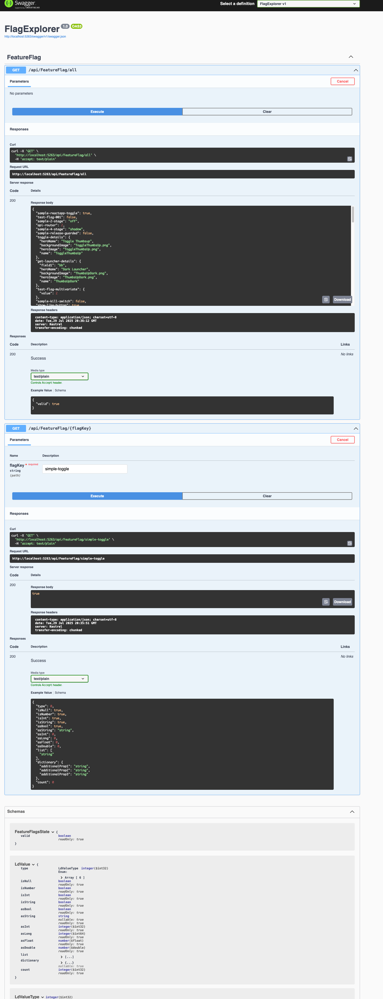

# FlagExplorer Demo

A .NET 10.0 web API demo application that demonstrates LaunchDarkly feature flag evaluation using the LaunchDarkly Server-Side SDK for .NET. This demo was originally developed by Ben Tan @ LaunchDarkly.

## Overview

This application provides a REST API to explore and evaluate LaunchDarkly feature flags. It includes endpoints to:
- Retrieve all feature flags for a given context
- Evaluate individual feature flags with custom user contexts
- View flag values and states through Swagger UI

## Prerequisites

- [.NET 10.0 SDK](https://dotnet.microsoft.com/download/dotnet/10.0) or later
- A LaunchDarkly account with a server-side SDK key

## Setup

1. **Configure LaunchDarkly SDK Key:**
   
   Set the `LAUNCHDARKLY_SDK_KEY` environment variable with your LaunchDarkly server-side SDK key:
   ```bash
   export LAUNCHDARKLY_SDK_KEY="sdk-xxxxxxxxxxxx"
   ```
   
   Alternatively, you can set it in `appsettings.json`:
   ```json
   {
     "LaunchDarkly": {
       "SdkKey": "sdk-xxxxxxxxxxxx"
     }
   }
   ```

2. **Restore dependencies:**
   ```bash
   dotnet restore
   ```

## Running the Application

Start the application:
```bash
dotnet run
```

The application will start and listen on `http://localhost:5263` (or the port configured in `launchSettings.json`).

You should see output similar to:
```
Building...
info: Microsoft.Hosting.Lifetime[14]
      Now listening on: http://localhost:5263
info: Microsoft.Hosting.Lifetime[0]
      Application started. Press Ctrl+C to shut down.
info: Microsoft.Hosting.Lifetime[0]
      Hosting environment: Development
*** SDK successfully initialized!
```

## API Documentation

Once the application is running, access the Swagger UI to explore the API:

```bash
open http://localhost:5263/swagger/index.html
```

Or navigate to: `http://localhost:5263/swagger/index.html` in your browser.

## API Endpoints

### Get All Flags
```
GET /api/FeatureFlag/all
```
Returns the state of all feature flags for the default demo user. Evaluation uses a **multi-context**: kind `user` (key from profile, attributes: name, email, phone_number, address) and kind `office` (key derived from office label, attribute `location` = profile office name).

### Evaluate a Specific Flag
```
GET /api/FeatureFlag/{flagKey}?contextKey={contextKey}
```
Evaluates a specific feature flag for a demo user resolved by `contextKey` from static profiles (`Models/DemoUserProfile.cs`).

**Parameters:**
- `flagKey` (path): The key of the feature flag to evaluate
- `contextKey` (query, optional): Selects the demo **user** context key (`user` kind). Same multi-context rules as above: **office** is a separate context with `location`. Known keys: `user-sandy-key`, `user-alex-key`, `user-morgan-key`, `user-ian-key`, `user-george-key`, `user-noone-key` (default: `user-sandy-key`). Unknown keys still use **Noone**’s profile for both user and office contexts.

**Example:**
```bash
curl "http://localhost:5263/api/FeatureFlag/my-flag-key?contextKey=user-alex-key"
```

## Project Structure

- `Program.cs` - Application entry point and service configuration
- `Controllers/FeatureFlagController.cs` - API endpoints for flag evaluation
- `Models/DemoUserProfile.cs` - Demo `contextKey` → static user attributes for LaunchDarkly contexts
- `Services/LaunchDarklyService.cs` - LaunchDarkly SDK client initialization
- `appsettings.json` - Configuration file (can include SDK key)

## Technologies Used

- **.NET 10.0** - Target framework
- **ASP.NET Core** - Web framework
- **LaunchDarkly Server-Side SDK for .NET** (v8.5.2) - Feature flag evaluation
- **Swashbuckle.AspNetCore** (v6.4.0) - Swagger/OpenAPI documentation

## Screenshot


